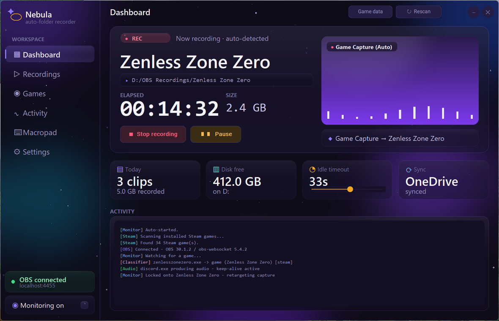
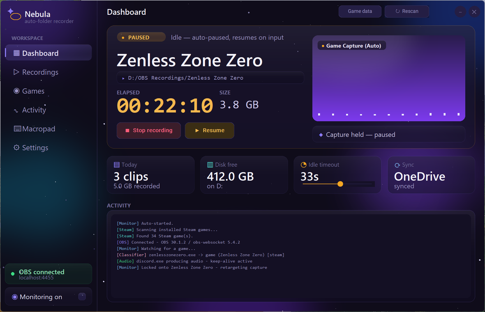

# Nebula

**Auto-record by game, auto-sorted by folder.**

Nebula is a Windows desktop app that watches for whatever game you're actually playing,
drives **OBS** recording over the obs-websocket v5 API, and files every clip into its own
per-game folder — without you having to remember to hit record.

It lives in the system tray, starts recording on its own the moment a game launches, pauses
when you go idle, and stops when you're done.



---

## What it does

- **Detects the active game automatically.** A Steam-aware hybrid classifier scans your
  installed Steam libraries and learns from what you actually run. Anything it doesn't
  recognise, it asks about once — then remembers.
- **Drives OBS for you.** Connects over obs-websocket v5, launches OBS if it isn't running,
  starts/stops recording, and retargets the Game Capture source at the game you're playing.
- **Sorts recordings per game.** Each title gets its own folder under your recording root.
- **Pauses when you're idle.** Configurable idle timeout, with a Discord-audio keep-alive so
  it doesn't pause mid-conversation just because you stopped moving the mouse.
- **Stays out of the way.** Runs from the tray with an animated icon, silent slide-in
  notifications instead of Windows toasts, and a global hotkey to toggle monitoring.
- **Syncs across machines.** Game classifications can live in a synced folder (e.g. OneDrive)
  so a game you classify on the laptop is already known on the desktop.

## The interface

The UI is an "Aurora" shell: a nav rail beside a dashboard built around one cinematic status
card that makes *what's recording right now* unmissable, and stays calm when nothing is
happening.

The hero card has four states:

| State | Looks like |
|-------|-----------|
| **Watching** | Violet, calm — standing by for a game to launch |
| **Recording** | Red, pulsing REC badge, live elapsed timer + file size straight from OBS |
| **Paused** | Amber, timer frozen — auto-paused on idle, resumes on input |
| **Offline** | OBS isn't connected |



Below it: today's clip count and size, free disk space, the live idle-timeout slider, your
sync target, and a colour-tagged activity log so a glance tells you which subsystem is talking.

The whole thing is a fixed-pixel canvas design with a generated nebula backdrop and genuinely
translucent glass panels, scaled by one uniform factor so it stays crisp and proportional on
high-DPI displays.

> The nav rail's other destinations (Recordings, Games, Activity, Macropad, Settings) are
> scaffolded but not yet implemented — Dashboard is the working view.

## Requirements

- Windows (uses Win32 APIs for DPI, foreground-window detection and the tray icon)
- Python 3.12 (what it's developed against; earlier 3.x may well work)
- [OBS Studio](https://obsproject.com/) 28+ with **obs-websocket v5** enabled
  (Tools → WebSocket Server Settings)

## Run

```bash
pip install -r requirements.txt
```

```bash
python main.py
```

Day to day you'll want it silent, with no console window:

```bash
pythonw main.py
```

It starts minimised to the tray and connects + starts monitoring on its own.

## Build a standalone .exe

```bash
pyinstaller nebula.spec
```

Produces a single-file, windowed `dist/Nebula.exe` — no separate Python install needed to run it.

## Configuration

Settings live in `config.json` next to the executable (created on first run):

| Key | Default | What it does |
|-----|---------|--------------|
| `obs_host` / `obs_port` | `localhost` / `4455` | obs-websocket connection |
| `obs_password` | *(empty)* | obs-websocket password, if you've set one |
| `recording_root` | `D:/OBS Recordings` | Where per-game folders are created |
| `sync_folder` | *(empty — local only)* | Where `games.json` lives. Point it at e.g. `OneDrive/ObsAutoFolder` so classifications follow you between machines |
| `idle_timeout_seconds` | `4` | Idle time before recording auto-pauses |
| `poll_interval_seconds` | `1` | How often the monitor checks the foreground window |
| `min_clip_seconds` | `10` | Clips shorter than this are auto-deleted (catches a window that just flickered) |
| `obs_path` | — | OBS executable, used to auto-launch it if it isn't running |
| `toggle_hotkey` | — | Global key to toggle monitoring on/off |

A *relative* `sync_folder` resolves against each machine's own home directory, so the same
config file works on machines with different Windows usernames.

## How it fits together

| Module | Role |
|--------|------|
| `main.py` | Entry point: logging → config → classifier → window + tray |
| `obsauto/monitor.py` | The core loop — foreground/idle detection, start/stop/retarget recording |
| `obsauto/obs_client.py` | Minimal obs-websocket v5 client |
| `obsauto/classifier.py` | Game vs non-game classification (Steam-aware) |
| `obsauto/steam_scanner.py` | Scans Steam libraries, parses VDF, classifies AppIDs |
| `obsauto/gui.py` | The Aurora UI |
| `obsauto/theme_art.py` | Generates the nebula backdrop and glass panels |
| `obsauto/audio_detect.py` | Detects whether a watched app (e.g. Discord) is producing audio |
| `obsauto/tray_app.py` | Tray icon and menu |

## Licence

No licence file is included yet.
