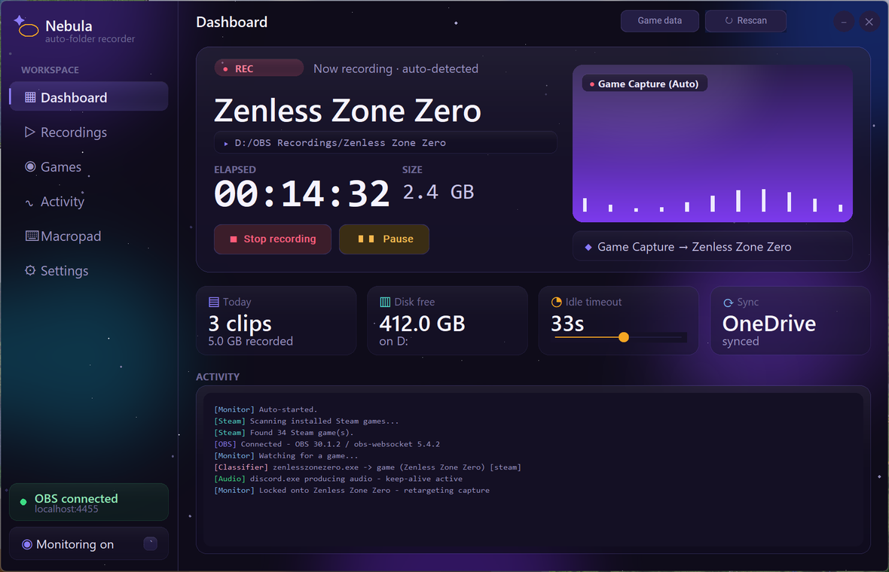
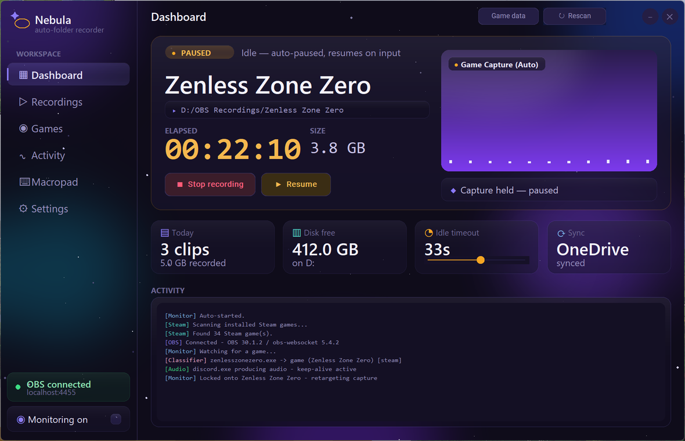

# Nebula

**Auto-record by game, auto-sorted by folder.**

Nebula is a Windows desktop app that watches for whatever game you're actually playing,
drives **OBS** recording over the obs-websocket v5 API, and files every clip into its own
per-game folder — without you having to remember to hit record.

It lives in the system tray, starts recording on its own the moment a game launches, pauses
when you go idle, and stops when you're done.



---

## Install

**[Download the latest Nebula.exe →](https://github.com/theoriginalcheese/nebula/releases/latest)**

One file. No Python, no installer, nothing to uninstall — put it wherever you want Nebula to
live and double-click it.

1. Install [OBS Studio](https://obsproject.com/) 28 or newer if you haven't already, and turn
   on **Tools → WebSocket Server Settings → Enable WebSocket server**. Nebula talks to OBS
   through that; it is the one thing it cannot do for you.
2. Run `Nebula.exe`. On a machine that has never run it before, a **four-step setup** walks
   you through connecting to OBS (with a Test button that tells you what is wrong if it
   can't), choosing where clips go, scanning your Steam library, and picking the toggle
   hotkey.
3. It minimises to the tray and starts watching. Launch a game and it records.

> **Where its files live.** Nebula keeps `config.json`, `games.json`, `logs/` and its icon
> cache **next to the exe**, not in `%APPDATA%`. Put it in its own folder — `C:\Nebula\`, say
> — rather than loose in Downloads. Moving that folder moves your whole setup with it.

Windows will warn that it's from an unknown publisher; the build isn't code-signed. *More
info → Run anyway*, or build it yourself from source (below) if you'd rather not take that
on trust.

### Setting up a second machine

Nebula's per-machine settings (recording folder, NAS path) are deliberately **not** synced —
those differ per PC and the setup flow asks for them. What you *do* want shared is the game
list. Fill in **Settings → Game list sync** with a private GitHub repo and token on both
machines, and a game you classify on one is known on the other within seconds. See
[Cross-device sync setup](#cross-device-sync-setup).

## What it does

- **Detects the active game automatically.** A Steam-aware hybrid classifier scans your
  installed Steam libraries and learns from what you actually run. Anything it doesn't
  recognise, it asks about once — then remembers.
- **Drives OBS for you.** Connects over obs-websocket v5, launches OBS if it isn't running,
  starts/stops recording, and retargets the Game Capture source at the game you're playing.
- **Sorts recordings per game.** Each title gets its own folder under your recording root.
- **Pauses when you're idle.** Configurable idle timeout, with a Discord-audio keep-alive so
  it doesn't pause mid-conversation just because you stopped moving the mouse.
- **Stays out of the way.** Runs from the tray with an animated icon, silent slide-in
  notifications instead of Windows toasts, and a global hotkey to toggle monitoring.
- **Syncs your game list across machines via GitHub.** Classifications live in a private
  GitHub repo; Nebula pulls on startup and pushes after each change, so a game you classify
  on one PC is instantly known on the others. Merge-safe (two machines can't wipe each other)
  and fails soft when offline.
- **Offloads recordings to a NAS.** Finished clips are copied to a NAS path and **byte-verified
  (SHA-256)** before the local original is removed — a recording is never deleted without a
  confirmed good copy. Survives the NAS going offline (queues and retries) and app restarts.

## The interface

The UI is an "Aurora" shell: a nav rail beside a dashboard built around one cinematic status
card that makes *what's recording right now* unmissable, and stays calm when nothing is
happening.

The hero card has four states:

| State | Looks like |
|-------|-----------|
| **Watching** | Violet, calm — standing by for a game to launch |
| **Recording** | Red, pulsing REC badge, live elapsed timer + file size straight from OBS |
| **Paused** | Amber, timer frozen — auto-paused on idle, resumes on input |
| **Offline** | OBS isn't connected |



Below it: today's clip count and size, free disk space, the live idle-timeout slider, your
sync target, and a colour-tagged activity log so a glance tells you which subsystem is talking.

The whole thing is a fixed-pixel canvas design with a generated nebula backdrop and genuinely
translucent glass panels, scaled by one uniform factor so it stays crisp and proportional on
high-DPI displays.

> The nav rail's other destinations (Recordings, Games, Activity, Macropad, Settings) are
> scaffolded but not yet implemented — Dashboard is the working view.

## Requirements

- Windows (uses Win32 APIs for DPI, foreground-window detection and the tray icon)
- Python 3.12 (what it's developed against; earlier 3.x may well work)
- [OBS Studio](https://obsproject.com/) 28+ with **obs-websocket v5** enabled
  (Tools → WebSocket Server Settings)

## Run

```bash
pip install -r requirements.txt
```

```bash
python main.py
```

Day to day you'll want it silent, with no console window:

```bash
pythonw main.py
```

It starts minimised to the tray and connects + starts monitoring on its own.

## Build a standalone .exe

The shipping build is **v4**, which renders the UI as HTML in a WebView2 window rather than
on a Tk canvas:

```bash
pyinstaller nebula-v4.spec
```

Produces a single-file, windowed `dist/Nebula-v4.exe` — no separate Python install needed to
run it. WebView2 ships with Windows 11 and with any recent Edge, so there is nothing else to
install.

The older Tk build is still buildable while v4 finishes settling:

```bash
pyinstaller nebula.spec
```

⚠️ **The frozen build and a source run do not share data.** `APP_DIR` resolves next to the
executable, so `dist/Nebula-v4.exe` reads `dist/config.json` while `python spike/app.py`
reads the repo root's. A setting changed in one is invisible to the other, and when you're
checking whether a build works it's `dist/logs/obsauto.log` you want, not `logs/`.

## Configuration

Settings live in `config.json` next to the executable (created on first run):

| Key | Default | What it does |
|-----|---------|--------------|
| `obs_host` / `obs_port` | `localhost` / `4455` | obs-websocket connection |
| `obs_password` | *(empty)* | obs-websocket password, if you've set one |
| `recording_root` | `D:/OBS Recordings` | Where per-game folders are created |
| `sync_folder` | *(empty — local only)* | Where `games.json` lives. Point it at e.g. `OneDrive/ObsAutoFolder` so classifications follow you between machines |
| `idle_timeout_seconds` | `4` | Idle time before recording auto-pauses |
| `poll_interval_seconds` | `1` | How often the monitor checks the foreground window |
| `min_clip_seconds` | `10` | Clips shorter than this are auto-deleted (catches a window that just flickered) |
| `obs_path` | — | OBS executable, used to auto-launch it if it isn't running |
| `toggle_hotkey` | — | Global key to toggle monitoring on/off |
| `github_token` | *(empty)* | Token with `repo` scope for the game-list sync. **Local only — never committed or synced.** |
| `github_gamedata_repo` | *(empty)* | `owner/name` of the private repo holding `games.json` |
| `github_gamedata_path` | `games.json` | File path within that repo |
| `nas_offload_root` | *(empty)* | Destination for finished clips, e.g. a mapped drive `Z:/OBS Recordings` or a UNC path. Blank = offload off. |
| `nas_offload_mode` | `copy` | `copy` keeps both copies; `move` deletes the local original **after** the NAS copy is byte-verified |
| `nas_offload_date_folders` | `false` | On: new copies land in `<Game>/YYYY-MM/` (the clip's own month). Nothing already on the NAS moves. |
| `clip_cache_max_gb` | `50` | Cap for the on-demand clip cache (`clip_cache/`). Oldest cached copies go first; NAS originals and recordings are never touched. `0` = no cap. |

The table above is the short list worth documenting in prose. The authoritative,
complete set — replays, appearance, Moonlight remote, hotkeys, offload paths,
cull thresholds — is [`obsauto/settings_spec.py`](obsauto/settings_spec.py)
(`FIELDS`, with defaults from `obsauto/config.py`); the Settings pane renders
it directly, so anything added there appears in the app without README edits.

### Elevated OBS (Hoyoverse / fullscreen capture)

Some games need OBS running as Administrator. Nebula stays non-elevated and launches OBS
via a one-time scheduled task (`NebulaLaunchOBS`) so each start skips the UAC prompt.

```powershell
# Approve UAC once when this runs:
powershell -ExecutionPolicy Bypass -File scripts\setup-obs-elevated-task.ps1
```

After that, Nebula's `ensure_obs_running` prefers `schtasks /run /tn NebulaLaunchOBS` and
falls back to `obs_path` only if the task is missing.

### Keeping up to date

- **Packaged `Nebula.exe`:** Settings → Updates → **Check for updates**, then
  **Install & relaunch**. That downloads the newer exe from GitHub Releases,
  swaps it over this build after quit, and starts again. Or grab
  [releases/latest](https://github.com/theoriginalcheese/nebula/releases/latest)
  by hand.
- **Source clone (`python main.py` / `python spike/app.py`):** Settings → Updates
  → **Save this machine** before you leave a PC, **Load latest** when you sit
  down at the other, then hit **Restart now**. Both talk to `origin/main`.

```powershell
powershell -ExecutionPolicy Bypass -File scripts\save-to-github.ps1
powershell -ExecutionPolicy Bypass -File scripts\update-from-github.ps1
```

### Cross-device sync setup

- **Game list (GitHub):** create a private repo, set `github_gamedata_repo` and a `github_token`
  (`repo` scope) in each machine's `config.json`. The token stays local — it's never committed
  (`config.json` is gitignored) and never travels in the synced `games.json`.
- **Recordings (NAS):** set `nas_offload_root` to a path each machine can reach. On a machine
  where the NAS is a mapped drive that's just `Z:/OBS Recordings`; over Tailscale it's a UNC
  path like `\\<nas-ip>\<share>\OBS Recordings` (mount it once with saved credentials). Nebula
  keeps clips local and retries whenever the path isn't reachable, so it's safe to set ahead of
  mounting.

## How it fits together

| Module | Role |
|--------|------|
| `main.py` | Entry point: logging → config → classifier → window + tray |
| `obsauto/monitor.py` | The core loop — foreground/idle detection, start/stop/retarget recording |
| `obsauto/obs_client.py` | Minimal obs-websocket v5 client |
| `obsauto/classifier.py` | Game vs non-game classification (Steam-aware) |
| `obsauto/steam_scanner.py` | Scans Steam libraries, parses VDF, classifies AppIDs |
| `obsauto/gui.py` | The Aurora UI (nav-rail shell, tile-grid dashboard) |
| `obsauto/gamesync.py` | Game-list sync via the GitHub contents API (merge-safe, fails soft) |
| `obsauto/offload.py` | Copy-verify-delete recording offload to the NAS |
| `obsauto/theme_art.py` | Generates the nebula backdrop and glass panels |
| `obsauto/audio_detect.py` | Detects whether a watched app (e.g. Discord) is producing audio |
| `obsauto/tray_app.py` | Tray icon and menu |

## Tests

```bash
python tests/test_async_connect.py   # async OBS connect, error handling
python tests/test_views.py           # nav views + tile-grid dashboard
python tests/test_list_views.py      # Recordings/Games populate
python tests/test_frame_pacing.py    # visible-window frame budget
python tests/test_gamesync.py        # game-list sync (mocked GitHub API)
python tests/test_offload.py         # NAS offload safety invariants
python tests/stress_test.py          # integrated stress under adverse load
```

All need a desktop session (they create a hidden Tk window); none need OBS.

## Licence

No licence file is included yet.
